# Microsoft 365 Copilot Chat — Análisis ejecutivo para expansión de servicio digital PyME

## Objetivo de la práctica:
Al finalizar la práctica, serás capaz de:
- Priorizar información ejecutiva proveniente de correos, conversaciones y notas relacionadas con el lanzamiento de un nuevo servicio financiero digital para PyMEs.
- Utilizar Microsoft 365 Copilot Chat para sintetizar riesgos, oportunidades, áreas involucradas y decisiones requeridas por el Comité Ejecutivo.
- Preparar un insumo estructurado que será utilizado posteriormente en Word para construir la propuesta ejecutiva formal.

## Duración aproximada:
- 25 minutos.

## Tabla de ayuda:
| Elemento | Valor de referencia | Observaciones |
| --- | --- | --- |
| Aplicaciones principales | Outlook, Microsoft 365 Copilot Chat | Usar cuenta corporativa con acceso a Microsoft 365 Copilot. |
| Modo de trabajo | Chat o edición | El instructor decidirá si usa OpenAI o Claude según disponibilidad, calidad de redacción y política del entorno. |
| Escenario | Expansión de servicio financiero digital para PyMEs | El comité ejecutivo evaluará riesgos, oportunidades e impacto estratégico. |
| Fuentes de información | Correos sobre riesgos regulatorios, comentarios de clientes, solicitudes financieras y observaciones operativas | Usar datos ficticios o anonimizados. No utilizar información real de clientes.
| Entregable de la demostración | Brief ejecutivo base | Este insumo será reutilizado en la demostración de Copilot en Word. |

## Instrucciones 

### Tarea 1. Preparar el contexto ejecutivo desde Outlook.
Paso 1. Abrir Outlook con la cuenta corporativa asignada para la demostración.

Paso 2. En Outlook, en la barra de búsqueda, buscar correos relacionados con el lanzamiento del nuevo servicio financiero digital para PyMEs usando palabras clave como: `PyME`, `servicio digital`, `lanzamiento`, `riesgo`, `regulatorio`, `finanzas`, `operaciones` y `clientes`.

Paso 3. Identificar al menos cuatro cadenas de correo que representen las siguientes perspectivas:
- Riesgos regulatorios.
- Comentarios o inquietudes de clientes.
- Solicitudes del área financiera.
- Observaciones operativas para la salida a producción.

    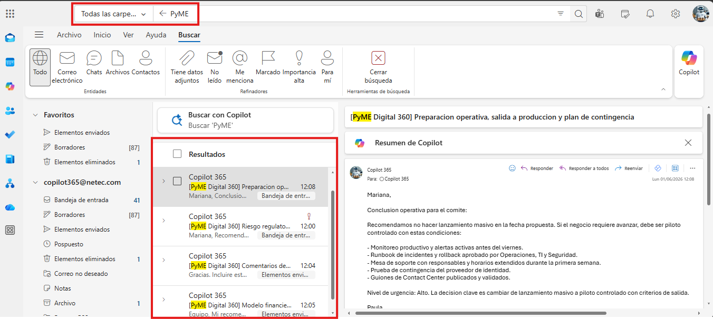

> [!Nota]
> Se utilizan datos ficticios o anonimizados para evitar compartir información sensible. El objetivo es simular un escenario realista sin comprometer la confidencialidad, sin embargo, el instructor puede adaptar el escenario con ejemplos más cercanos a la realidad de los participantes, siempre cuidando la privacidad y seguridad de la información.


Paso 4. En Outlook, dar clic en el respectivo hilo de correos. Luego, dar clic en el botón de Copilot para resumir cada cadena de correo. Solicitar que el resumen tenga orientación ejecutiva, foco en decisiones y detección de riesgos. 

Prompt sugerido:
```text
Resume esta cadena de correos desde una perspectiva ejecutiva. Identifica:
1. Tema principal.
2. Riesgos mencionados.
3. Oportunidades identificadas.
4. Áreas involucradas.
5. Decisiones o acciones pendientes.
6. Nivel de urgencia: alto, medio o bajo.
```

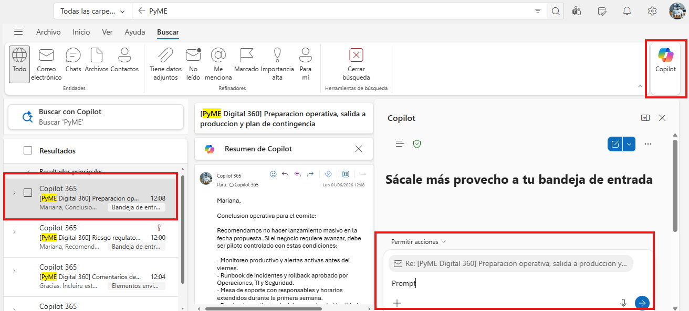

Paso 5. Solicitar a Copilot integre en un solo mensaje todos los resúmenes obtenidos. Luego exportar en word o copiar el resultado en un bloc de notas temporal para su uso posterior.

Prompt sugerido:
```text
Integra los resúmenes anteriores en un solo mensaje con esta estructura:
- Riesgos regulatorios.
- Comentarios o inquietudes de clientes.
- Solicitudes del área financiera.
- Observaciones operativas para la salida a producción.

```
> [!Nota]
> Explicar a los participantes que esta primera actividad no es una tarea aislada, sino la preparación del contexto que alimentará el análisis ejecutivo de Copilot Chat y, posteriormente, la propuesta en Word y la presentación en PowerPoint.

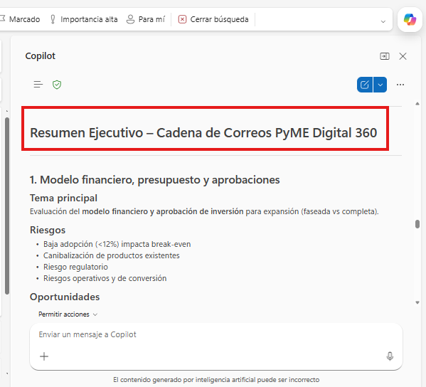

---

### Tarea 2. Consolidar la información en Microsoft 365 Copilot Chat.
Paso 1. Abrir Microsoft 365 Copilot Chat desde la aplicación de Microsoft 365: https://m365.cloud.microsoft.com/ 

Paso 2. Dar clic en "Nuevo chat" y pegar los resúmenes obtenidos desde Outlook y solicitar a Copilot una consolidación ejecutiva.

Prompt sugerido:
```text
Actúa como asesor ejecutivo para un banco. Con base en los siguientes resúmenes de correos sobre la posible expansión de un nuevo servicio financiero digital para PyMEs, genera un análisis ejecutivo para el Comité de Dirección.

Necesito que entregues:
1. Resumen ejecutivo de máximo 180 palabras.
2. Principales riesgos operativos, regulatorios, financieros y reputacionales.
3. Oportunidades estratégicas para el banco.
4. Áreas internas que deben participar.
5. Decisiones que debe tomar el comité.
6. Preguntas críticas que aún deben resolverse.

Información de entrada:
[Pegar aquí los resúmenes de Outlook]
```
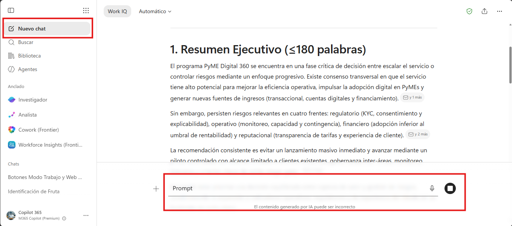

Paso 4. Revisar la respuesta generada y pedir a Copilot que diferencie claramente hechos, supuestos y recomendaciones.

Prompt sugerido:
```text
Revisa tu respuesta anterior y separa la información en tres grupos:
1. Hechos observados en los correos.
2. Supuestos que estás infiriendo.
3. Recomendaciones ejecutivas.

Presenta el resultado en una tabla clara para un comité ejecutivo.
```
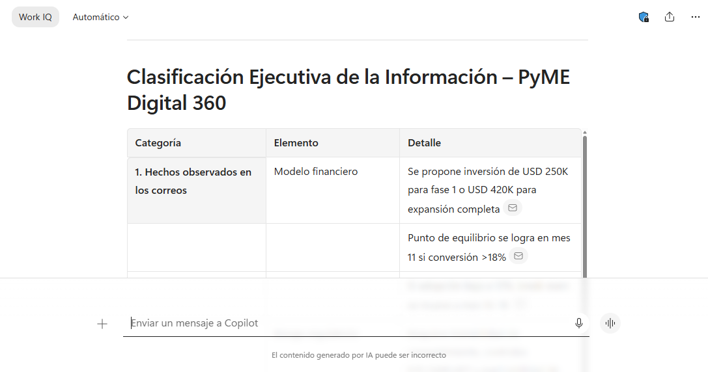

Paso 5. Solicitar una matriz de priorización para visualizar riesgos y oportunidades.

Prompt sugerido:
```text
Crea una matriz ejecutiva de priorización con las columnas: Tema, Tipo, Impacto esperado, Urgencia, Área responsable, Acción recomendada y Riesgo de no actuar. Usa una escala de impacto y urgencia: Alto, Medio o Bajo.
```
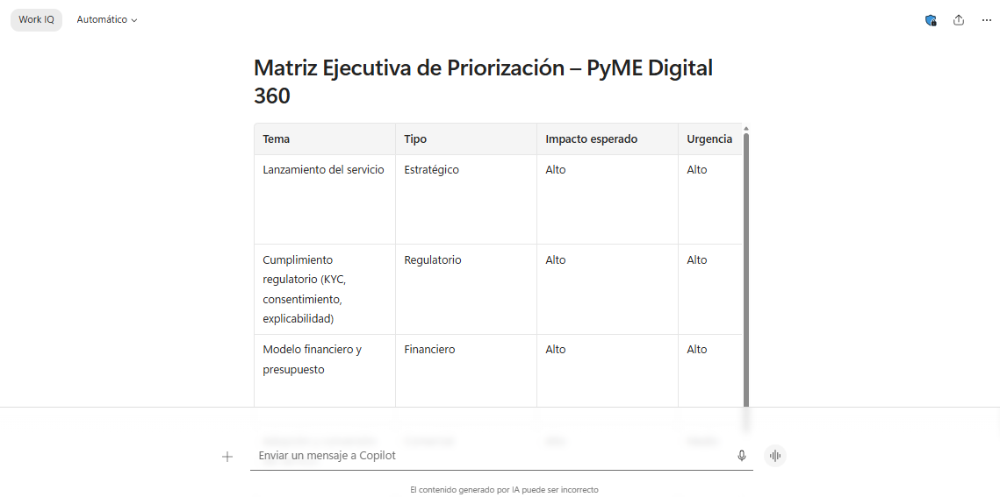

Paso 6. Pedir a Copilot que genere una versión más breve, orientada a dirección general.

Prompt sugerido:
```text
Convierte el análisis anterior en un brief ejecutivo de una página, con lenguaje claro, directo y orientado a toma de decisiones. Evita tecnicismos innecesarios y prioriza lo que el Comité de Dirección debe decidir.
```
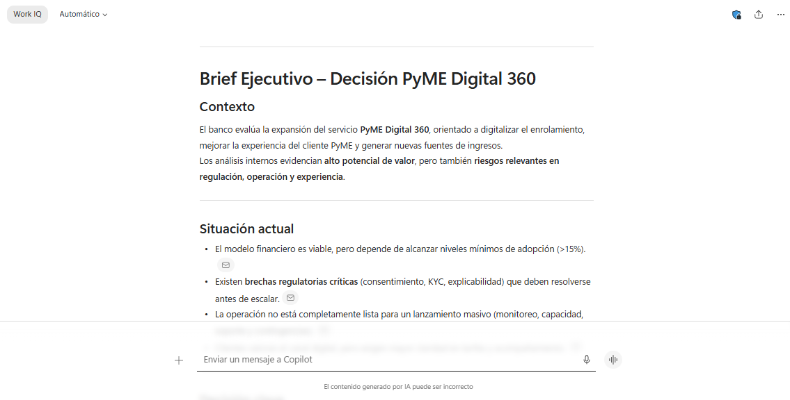

---

### Tarea 3. Validar el análisis con criterios ejecutivos.
Paso 1. Revisar si la respuesta de Copilot responde a las preguntas clave del comité: 
- ¿Qué se quiere lanzar?
- ¿Por qué es relevante?
- ¿Qué riesgos existen?
- ¿Qué oportunidades abre?
- ¿Qué decisión se solicita?

Paso 2. Solicitar a Copilot que identifique vacíos de información antes de pasar a Word.

Prompt sugerido:
```text
Antes de convertir este análisis en una propuesta ejecutiva, identifica los vacíos de información que podrían afectar la decisión del comité. Clasifica los vacíos por impacto: crítico, importante o complementario.
```
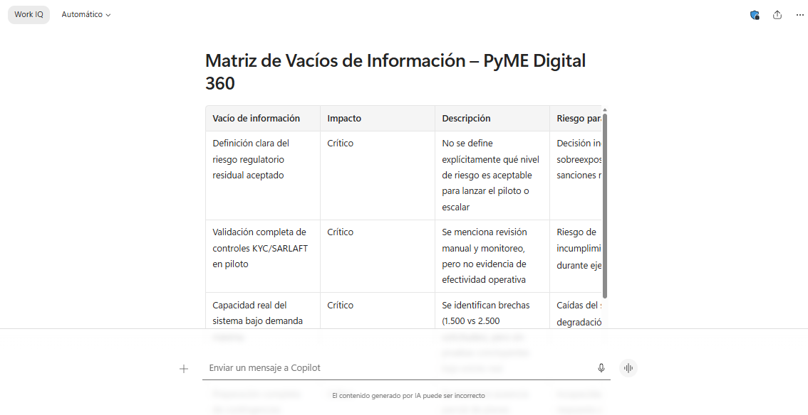

Paso 3. Solicitar recomendaciones iniciales para la dirección.

Prompt sugerido:
```text
Genera cinco recomendaciones iniciales para el Comité de Dirección. Cada recomendación debe incluir justificación, beneficio esperado y condición necesaria para ejecutarla.
```
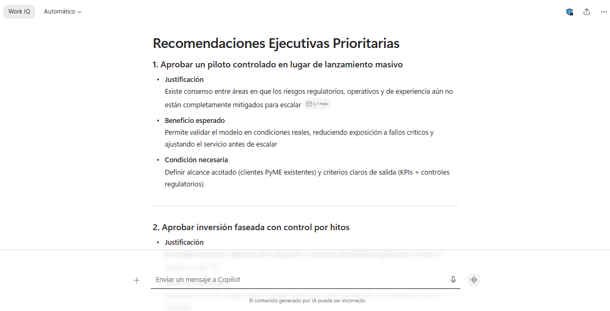

> [!Nota]
> Confirmar con los participantes que el análisis no reemplaza la validación humana. Resaltar que el instructor debe revisar consistencia, confidencialidad, sesgos, supuestos y fuentes antes de utilizar el resultado en documentos oficiales.

---

### Tarea 4. Preparar el insumo para la demostración de Copilot en Word.
Paso 1. Pedir a Copilot que entregue el contenido en una estructura lista para convertirse en documento ejecutivo.

Prompt sugerido:
```text
Organiza todo el análisis en una estructura lista para Word con estas secciones:
1. Título del documento.
2. Resumen ejecutivo.
3. Contexto de negocio.
4. Riesgos principales.
5. Oportunidades estratégicas.
6. Áreas involucradas.
7. Decisiones solicitadas al comité.
8. Próximos pasos sugeridos.
9. Anexos o información pendiente por validar.
```
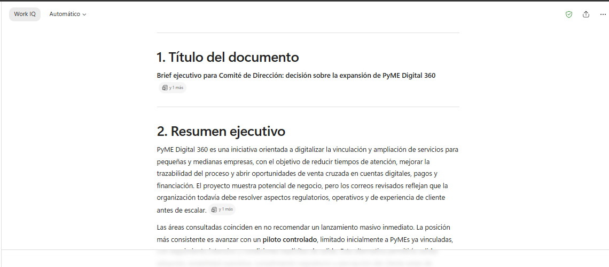

> [!Nota]
> Este insumo será utilizado en la siguiente demostración para construir la propuesta formal con Copilot en Word.

### Resultado esperado
Al finalizar la demostración, el participante debe observar un flujo continuo en el que Outlook aporta el contexto, Copilot Chat organiza el análisis y el resultado queda listo para transformarse en una propuesta ejecutiva.

Resultado esperado del brief:
| Sección | Resultado esperado |
| --- | --- |
| Resumen ejecutivo | Síntesis clara sobre la expansión del servicio digital PyME. |
| Riesgos | Lista priorizada de riesgos regulatorios, operativos, financieros y reputacionales. |
| Oportunidades | Beneficios estratégicos, crecimiento potencial y mejora de experiencia del cliente. |
| Áreas involucradas | Riesgos, cumplimiento, operaciones, tecnología, finanzas, comercial y experiencia de cliente. |
| Decisiones | Aprobación de evaluación, asignación de responsables, validación regulatoria y definición de próximos pasos. |


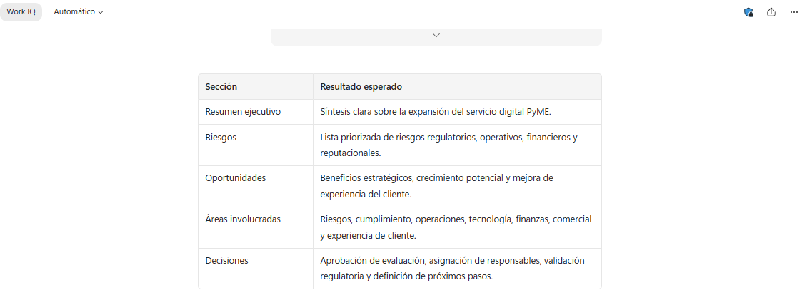