# Copilot en Word — Propuesta ejecutiva para expansión del servicio financiero digital

## Objetivo de la práctica:
Al finalizar la práctica, serás capaz de:
- Transformar el brief generado en Microsoft 365 Copilot Chat en una propuesta ejecutiva estructurada en Word.
- Utilizar Copilot en Word para redactar, reorganizar, refinar y fortalecer el contenido de una propuesta para dirección.
- Preparar un documento fuente que servirá como base para crear una presentación ejecutiva en PowerPoint.

## Duración aproximada:
- 25 minutos.

## Tabla de ayuda:
| Elemento | Valor de referencia | Observaciones |
| --- | --- | --- |
| Aplicación principal | Microsoft Word con Copilot | Usar cuenta corporativa con acceso a Microsoft 365 Copilot. |
| Insumo requerido | Brief de la Demostración 1 | Utilizar el contenido generado en Copilot Chat. |
| Documento de salida | `Propuesta_Expansion_Servicio_Digital_PyMEs.docx` | Será la fuente para la presentación de PowerPoint. |
| Modo de trabajo | Edición asistida por Copilot | El instructor puede alternar entre redacción, revisión, reescritura y generación de tablas. |
| Recomendación de datos | Usar información ficticia o anonimizada | No incluir datos reales de clientes, contratos o riesgos confidenciales. |

## Instrucciones 

### Tarea 1. Crear el documento ejecutivo base en Word.
Paso 1. Abrir el chat de M365 Copilot y localizar el brief generado en la Demostración 1.

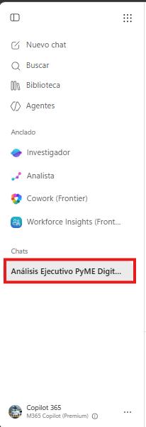


Paso 2. En la respuesta estructurada lista para word, dar clic en los tres puntos, luego en "exportar a" y por último seleccionar la opción "Word".

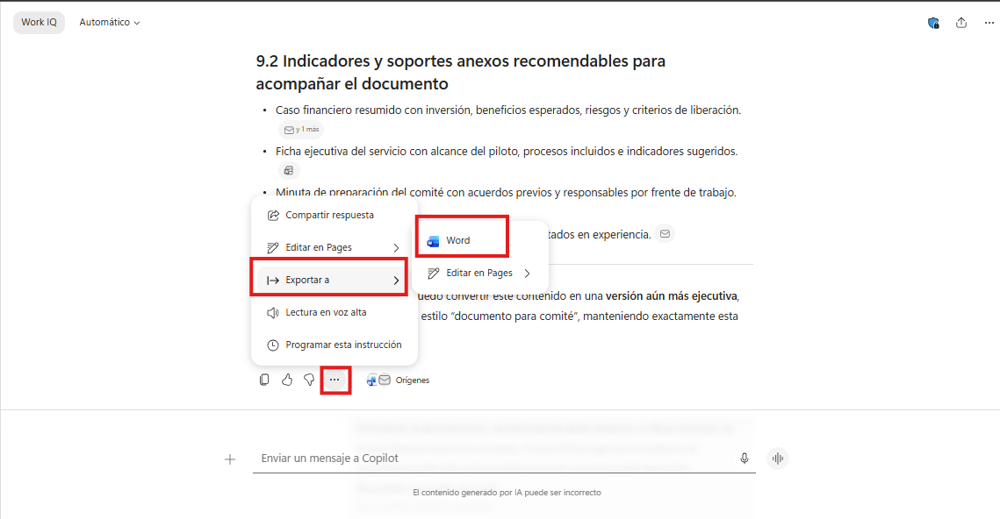

Paso 3. Cuando el documento quede guardado, dar clic en "Continuar a Word" para abrirlo directamente en Microsoft Word.

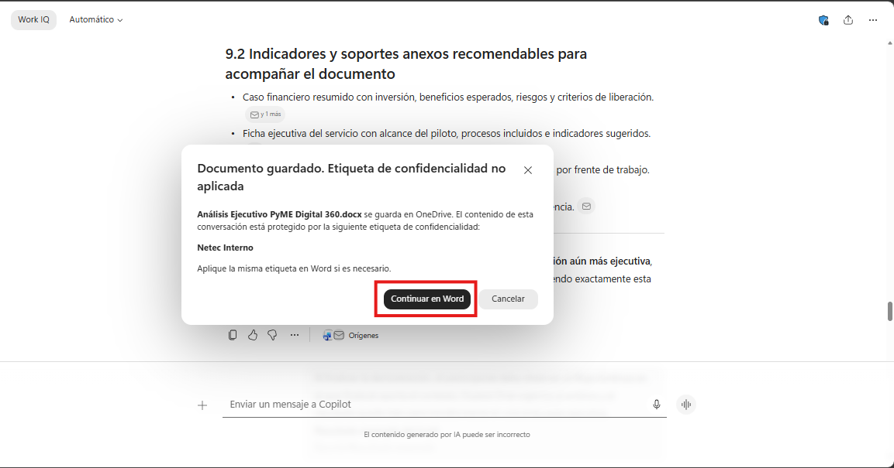

Paso 4. Cuando abra el documento en Word, dar clic en el botón de Copilot para iniciar la edición asistida.

Paso 5. Solicitar a Copilot que convierta el brief en una propuesta ejecutiva formal.

Prompt sugerido:
```text
Con base en la información del documento, redacta una propuesta ejecutiva para el Comité de Dirección de un banco que evalúa la expansión de un nuevo servicio financiero digital para PyMEs.

La propuesta debe incluir:
1. Resumen ejecutivo.
2. Contexto y oportunidad de negocio.
3. Alcance preliminar de la expansión.
4. Riesgos principales.
5. Oportunidades estratégicas.
6. Áreas involucradas.
7. Recomendación inicial.
8. Decisiones solicitadas al comité.
9. Próximos pasos.

Usa un tono ejecutivo, claro, sobrio y orientado a toma de decisiones. Reemplaza la información existente por la propuesta ejecutiva.

```

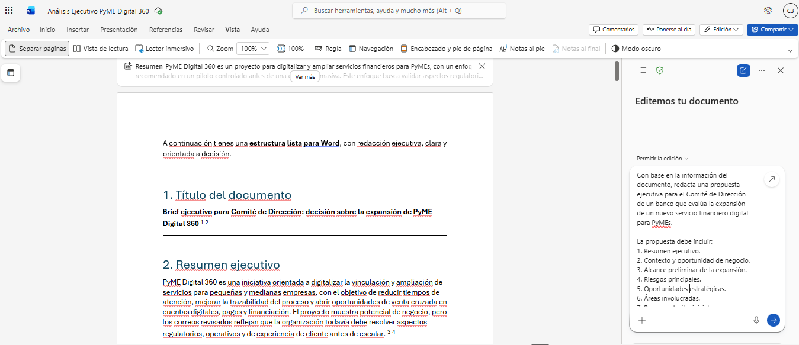

Paso 6. Revisar el borrador inicial y verificar que el documento mantenga coherencia con el escenario ejecutivo.

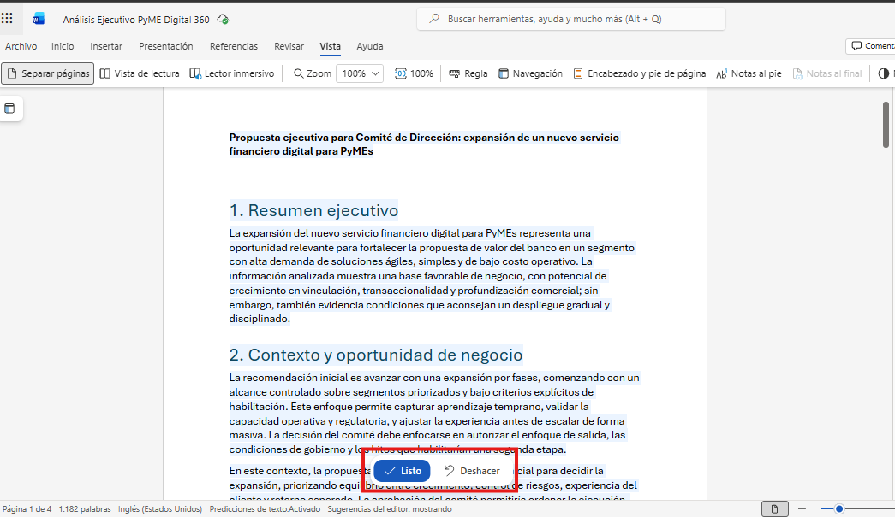

---

### Tarea 2. Refinar la propuesta con estructura ejecutiva.
Paso 1. Pedir a Copilot que mejore la claridad, elimine redundancias y fortalezca la orientación estratégica del documento.

Prompt sugerido:
```text
Revisa el documento y mejora su claridad ejecutiva. Reduce redundancias, fortalece la lógica de negocio y asegúrate de que cada sección contribuya a una decisión del Comité de Dirección.
```
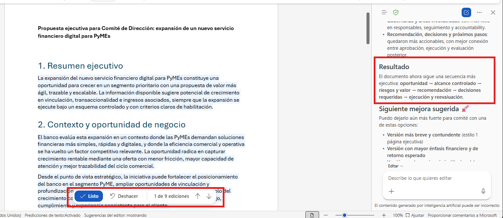

Paso 2. Solicitar a Copilot que agregue una sección breve de decisión ejecutiva.

Prompt sugerido:
```text
Agrega una sección al final del documento llamada "Decisión solicitada al Comité". Debe explicar de forma breve qué se espera aprobar, qué información queda pendiente y qué condiciones mínimas deben cumplirse antes del lanzamiento.
```
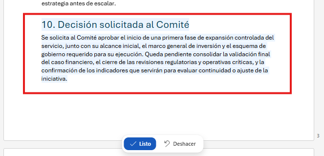

Paso 3. Solicitar a Copilot que convierta los riesgos en una tabla ejecutiva.

Prompt sugerido:
```text
Convierte la sección de riesgos en una tabla con las columnas: Riesgo, Categoría, Impacto, Probabilidad, Mitigación propuesta y Área responsable. Usa lenguaje ejecutivo y evita tecnicismos innecesarios.
```
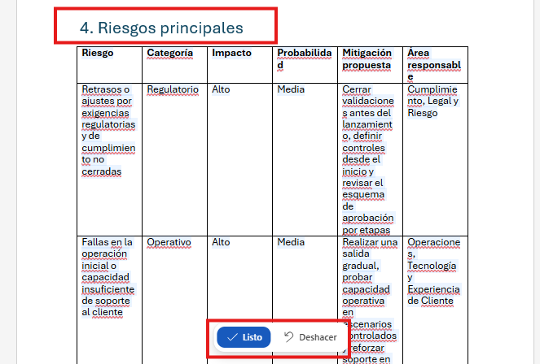

Paso 4. Solicitar a Copilot que incluya una tabla de áreas involucradas y responsabilidades.

Prompt sugerido:
```text
Crea una tabla de áreas involucradas con las columnas: Área, Rol en la expansión, Responsabilidad principal y Entregable esperado. Incluye como mínimo: Riesgos, Cumplimiento, Tecnología, Operaciones, Finanzas, Comercial y Experiencia de Cliente.
```
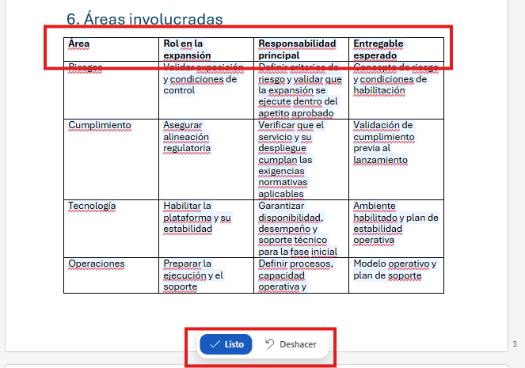

Paso 5. Revisar las tablas generadas y ajustar manualmente cualquier dato que no esté sustentado por el contexto entregado.

---

### Tarea 3. Convertir notas dispersas en una propuesta lista para dirección.
Paso 1. Pedir a Copilot que genere una introducción breve para contextualizar el documento.

Prompt sugerido:
```text
Redacta una introducción de máximo dos párrafos que explique por qué el banco está evaluando la expansión del servicio financiero digital para PyMEs y por qué este análisis es relevante para el Comité de Dirección.
```
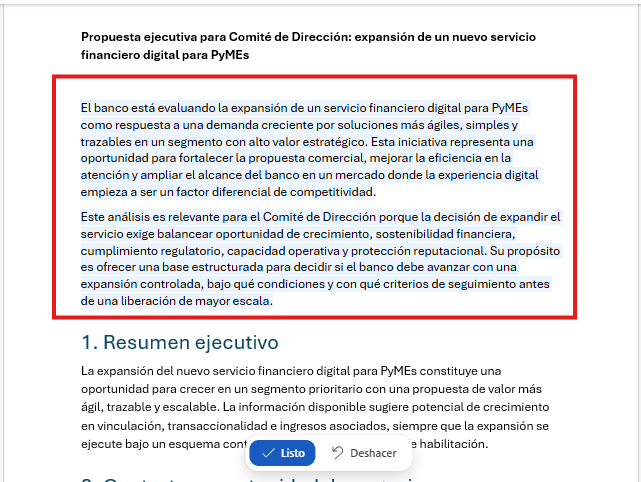

Paso 2. Solicitar a Copilot una versión más sintética del resumen ejecutivo.

Prompt sugerido:
```text
Resume el documento en un resumen ejecutivo de máximo 150 palabras. Debe mencionar oportunidad, riesgos, recomendación y decisión requerida. Insertalo en la sección de resumen ejecutivo al inicio del documento.
```
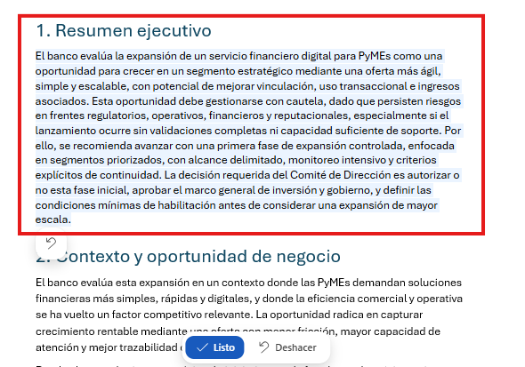

Paso 3. Solicitar a Copilot que agregue próximos pasos con responsables preliminares.

Prompt sugerido:
```text
Edita o agrega una sección de próximos pasos con una tabla que incluya: Acción, Responsable preliminar, Plazo sugerido, Dependencia y Resultado esperado.
```

> [!NOTE]
> Confirmar que el documento no incluya información sensible, datos personales, cifras no validadas ni compromisos regulatorios sin revisión humana.

---

### Tarea 4. Preparar el documento como fuente para PowerPoint.
Paso 1. Guardar el documento con el nombre `Propuesta_Expansion_Servicio_Digital_PyMEs`.

Paso 2. En la parte superior de la primera hoja, está la sección de resumen automático que Copilot generó para orientar la creación de la presentación ejecutiva. Revisar que esta sección tenga una estructura clara y mensajes breves.

Paso 3. Mencionar que este resumen sirve como guía para construir la presentación ejecutiva en PowerPoint, por lo que es importante que cada punto sea claro, directo y orientado a dirección. 

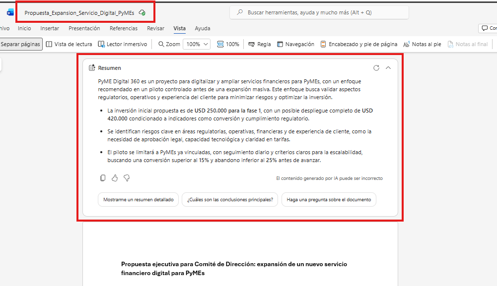

Paso 4. Dar clic en el botón "Mostrarme un resumen detallado" para que Copilot genere un resumen más estructurado que sirva como guion para la presentación.
> [!NOTE]
> Este resumen se generará en la ventana de Copilot, no en el documento. El instructor puede copiar y pegar este resumen en un documento aparte para usarlo como guion en la siguiente demostración de PowerPoint.

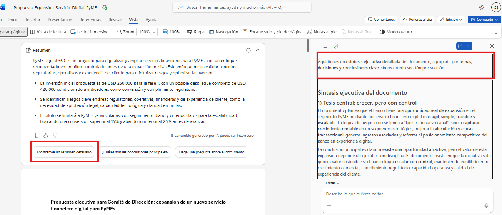

> [!NOTE]
> Este documento será utilizado como fuente en la siguiente demostración para construir una presentación ejecutiva con Copilot en PowerPoint. Es importante que el documento esté estructurado, claro y orientado a dirección para facilitar la generación de diapositivas ejecutivas.

### Resultado esperado
Al finalizar la demostración, el participante debe observar cómo un brief generado en Copilot Chat se transforma en una propuesta ejecutiva clara, estructurada y lista para ser usada como fuente de una presentación.

Estructura esperada del documento:
| Sección | Resultado esperado |
| --- | --- |
| Resumen ejecutivo | Síntesis breve con oportunidad, riesgos y decisión solicitada. |
| Contexto y oportunidad | Justificación del análisis y valor estratégico para el banco. |
| Riesgos principales | Tabla ejecutiva con impacto, probabilidad, mitigación y responsable. |
| Oportunidades estratégicas | Beneficios esperados para clientes PyME y para el banco. |
| Áreas involucradas | Mapa de responsabilidades por área interna. |
| Próximos pasos | Acciones recomendadas, responsables y plazos sugeridos. |
| Resumen para presentación | Guía de 8 diapositivas para PowerPoint. |

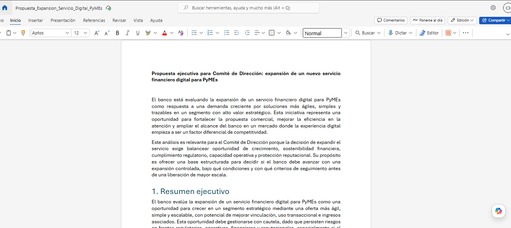