# Demostración 3: Copilot en PowerPoint — Presentación ejecutiva para el Comité de Dirección

## Objetivo de la práctica:
Al finalizar la práctica, serás capaz de:
- Crear una presentación ejecutiva en PowerPoint a partir de la propuesta generada en Word.
- Utilizar Copilot en PowerPoint para estructurar, resumir y mejorar el storytelling de una presentación para Comité de Dirección.
- Refinar diapositivas clave sobre riesgos, oportunidades, impacto esperado y próximos pasos estratégicos.

## Duración aproximada:
- 25 minutos.

## Tabla de ayuda:

| Elemento | Valor de referencia | Observaciones |
| --- | --- | --- |
| Aplicación principal | Microsoft PowerPoint con Copilot | Usar cuenta corporativa con acceso a Microsoft 365 Copilot. |
| Insumo requerido | `Propuesta_Expansion_Servicio_Digital_PyMEs.docx` | Documento generado en la Demostración 2. |
| Presentación de salida | `Comite_Direccion_Expansion_Servicio_Digital_PyMEs.pptx` | Entregable final de la experiencia de inmersión. |
| Tutorial de marca | Canal de Early Adopters en Teams | Mencionar el tutorial si no se muestra el paso a paso durante la sesión. |

## Instrucciones 

### Tarea 1. Crear la presentación desde el documento de Word.
Paso 1. Abrir Microsoft PowerPoint con la cuenta corporativa asignada.

Paso 2. Crear una presentación nueva.

Paso 3. Abrir Copilot en PowerPoint.

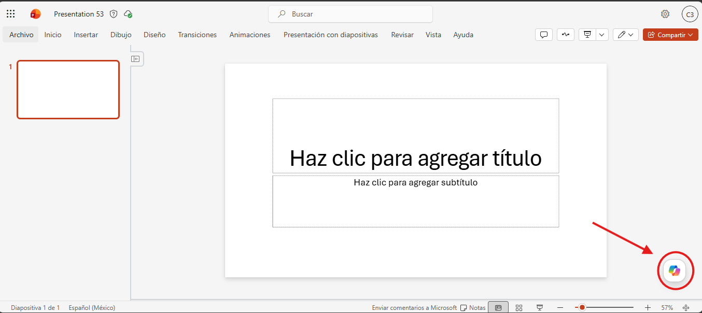

Paso 4. En el botón "Agregar contenido", seleccionar la opción "Agregar contenido de trabajo" y buscar el documento `Propuesta_Expansion_Servicio_Digital_PyMEs.docx` generado en la demostración anterior.

>[!NOTE]
> Si el documento no aparece, verificar que se haya guardado correctamente en OneDrive o SharePoint y que la cuenta de PowerPoint tenga acceso al mismo. En caso de no encontrarlo, se puede cargar manualmente en el botón "Cargar archivos".

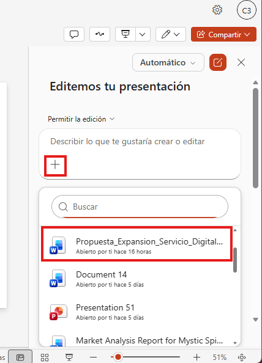

Paso 5. Solicitar a Copilot una presentación ejecutiva de 10 diapositivas.

Prompt sugerido:
```text
Crea una presentación ejecutiva de 10 diapositivas a partir de este documento. La audiencia es el Comité de Dirección de un banco. El objetivo es evaluar la expansión de un nuevo servicio financiero digital para PyMEs.

La presentación debe incluir:
1. Portada ejecutiva.
2. Contexto y oportunidad estratégica.
3. Propuesta de expansión del servicio.
4. Beneficios esperados para clientes PyME y para el banco.
5. Riesgos principales y mitigaciones.
6. Áreas involucradas y responsabilidades.
7. Decisiones solicitadas al comité.
8. Próximos pasos estratégicos.

Usa lenguaje ejecutivo, mensajes breves y enfoque visual.
```

Paso 6. Copilot hará preguntas adicionales para entender mejor el contexto y los objetivos de la presentación. Responder con claridad y enfocarse en la audiencia ejecutiva.

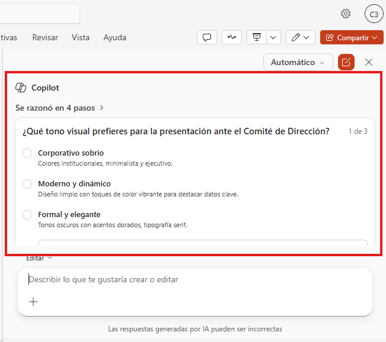

>[!NOTE]
>Las preguntas de Copilot pueden variar de acuerdo a la información que haya podido extraer del documento y su capacidad para entender el contexto.

Paso 7. Revisar la estructura generada y confirmar que cada diapositiva tenga un mensaje central claro.

> [!NOTE]
> Mientras se genera la presentación, mencionar que el resultado puede variar según la versión de Copilot, la calidad del documento fuente y la política de generación de contenido del entorno. El objetivo es mostrar un resultado inicial que luego se puede refinar, no necesariamente obtener una presentación perfecta en el primer intento.

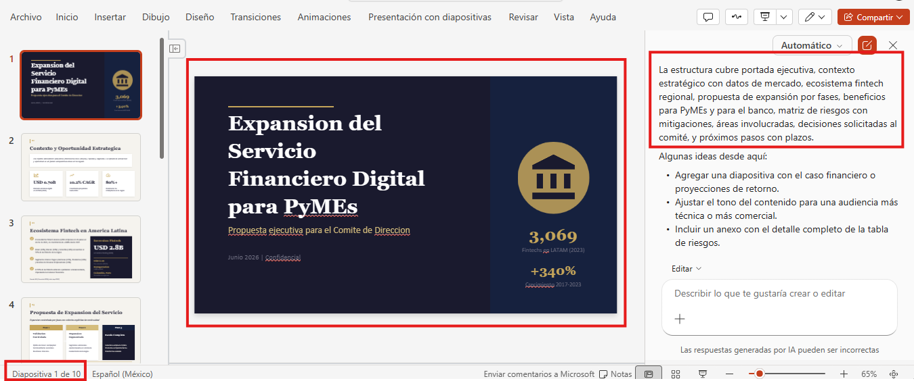
---

### Tarea 2. Refinar el storytelling ejecutivo.
Paso 1. Pedir a Copilot que reorganice la narrativa para que siga una secuencia lógica de decisión.

Prompt sugerido:
```text
Reorganiza la presentación para que cuente una historia ejecutiva clara: oportunidad, análisis, riesgos, decisión requerida y próximos pasos. Mantén máximo una idea principal por diapositiva.
```
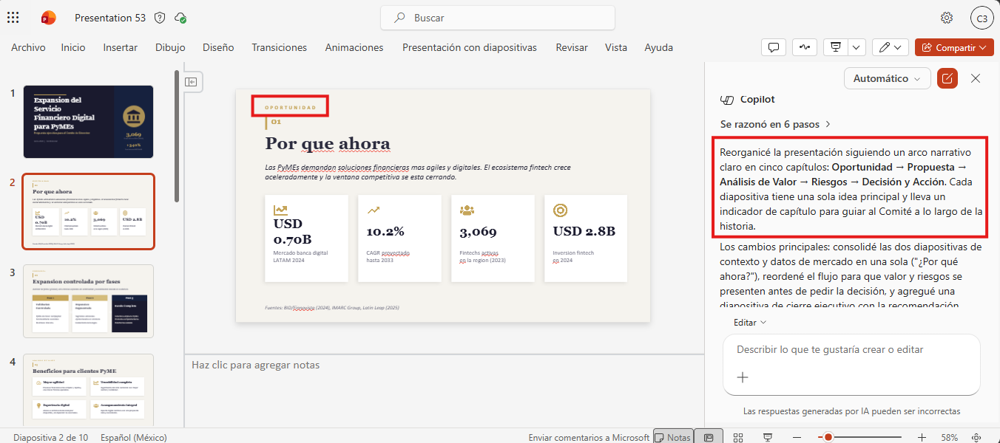

Paso 2. Solicitar que Copilot reduzca el texto excesivo y fortalezca los títulos de las diapositivas.

Prompt sugerido:
```text
Mejora los títulos de las diapositivas para que sean mensajes ejecutivos, no solo nombres de secciones. Reduce el texto excesivo y deja únicamente los puntos necesarios para una reunión de dirección.
```
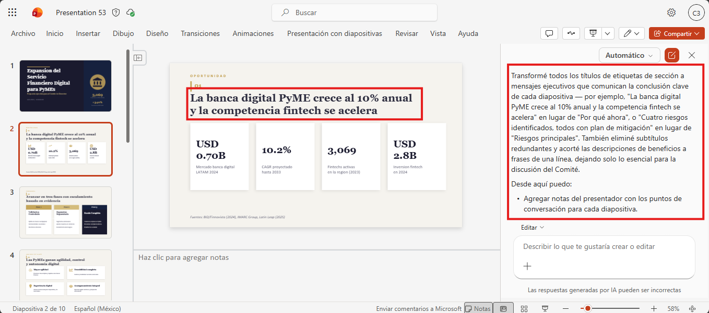

Paso 3. Pedir a Copilot que genere una diapositiva visual para próximos pasos.

Prompt sugerido:
```text
Convierte la sección de próximos pasos en una línea de tiempo ejecutiva con acciones, responsables preliminares y resultados esperados.
```

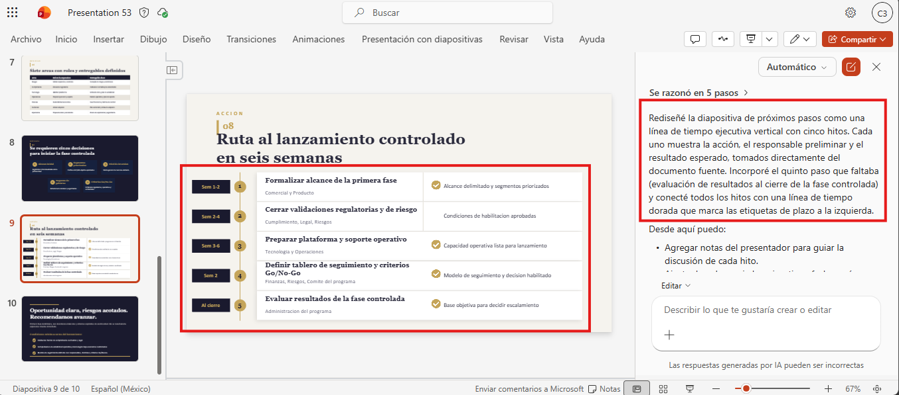

Paso 5. Revisar que los cambios mantengan coherencia con el documento fuente y no agreguen cifras, fechas o compromisos no validados.

Paso 6. Vamos a crear una diapositiva nueva de "Beneficios esperados". Para esto, se puede pedir a Copilot que genere una nueva diapositiva con un análisis específico.

Prompt sugerido:
```text
Crea una nueva diapositiva al final de la presentación titulada "Beneficios esperados". Resume los beneficios clave para los clientes PyME, el banco y la operación interna. Usa gráficos o íconos para hacerla visualmente atractiva.
```
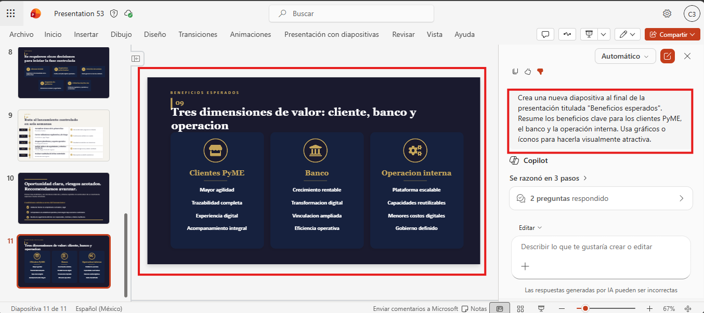

Paso 7. Cambiar la imagen de fondo de la diapositiva creada por una que sea más profesional y alineada con la identidad visual del banco.

Prompt sugerido:
```text
Cambia la imagen de fondo de esta diapositiva por una que sea profesional y alineada con la identidad visual de un banco. Prioriza imágenes relacionadas con tecnología, innovación o servicios financieros.
```
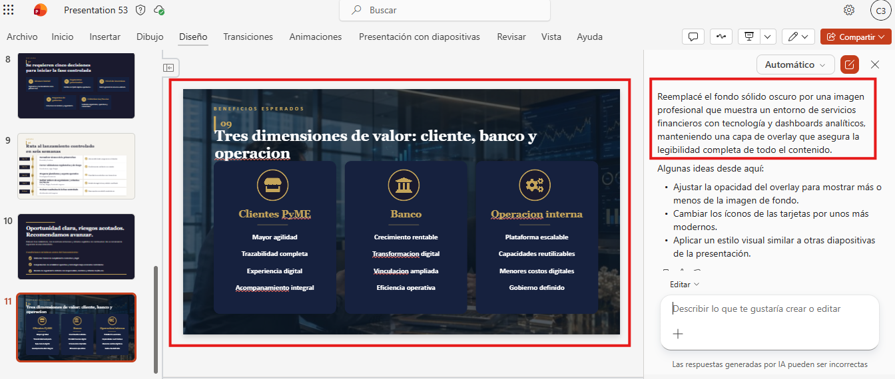

---

### Tarea 3. Crear notas del presentador y preparar la entrega final.
Paso 1. Solicitar a Copilot que genere notas del expositor para cada diapositiva.

Prompt sugerido:
```text
Genera notas del presentador para cada diapositiva. Las notas deben ayudar al instructor a explicar el mensaje clave en menos de un minuto por diapositiva, con tono ejecutivo y orientado a decisiones.
```

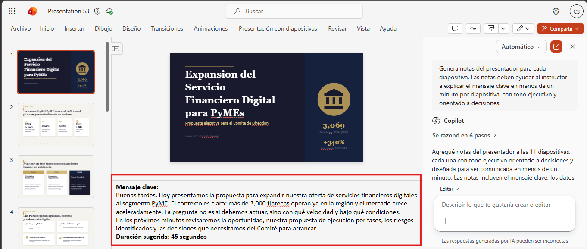

Paso 2. Revisar las notas del expositor y eliminar cualquier afirmación que no esté soportada por el documento fuente.

Paso 3. Confirmar que la presentación responda a las preguntas principales del comité:
- ¿Cuál es la oportunidad?
- ¿Qué riesgos existen?
- ¿Qué beneficios se esperan?
- ¿Qué áreas participan?
- ¿Qué decisión se solicita?
- ¿Cuáles son los próximos pasos?

Paso 4. Guardar la presentación con el nombre `Comite_Direccion_Expansion_Servicio_Digital_PyMEs`.

>[!NOTE]
> Explicar que la experiencia completa mostró un flujo de trabajo continuo: Outlook aportó señales, Copilot Chat sintetizó el análisis, Word estructuró la propuesta y PowerPoint convirtió el documento en una presentación para dirección.

### Resultado esperado
Al finalizar la demostración, el participante debe observar una presentación ejecutiva lista para revisión humana y exposición ante el Comité de Dirección.

Estructura esperada de la presentación:

| Diapositiva | Resultado esperado |
| --- | --- |
| 1. Portada ejecutiva | Nombre del proyecto, audiencia y propósito de la decisión. |
| 2. Contexto y oportunidad | Explicación breve del mercado PyME y necesidad estratégica. |
| 3. Propuesta de expansión | Descripción clara del servicio digital y alcance preliminar. |
| 4. Beneficios esperados | Valor para clientes, banco y operación interna. |
| 5. Riesgos y mitigaciones | Matriz visual con riesgos priorizados y responsables. |
| 6. Áreas involucradas | Mapa de colaboración interna y responsabilidades. |
| 7. Decisión solicitada | Aprobaciones, condiciones y validaciones pendientes. |
| 8. Próximos pasos | Línea de tiempo ejecutiva con acciones y responsables preliminares. |
| 9. Beneficios esperados | Resumen visual de beneficios clave con gráficos o íconos. |

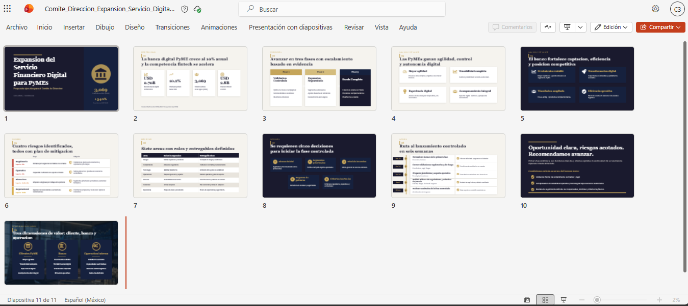
